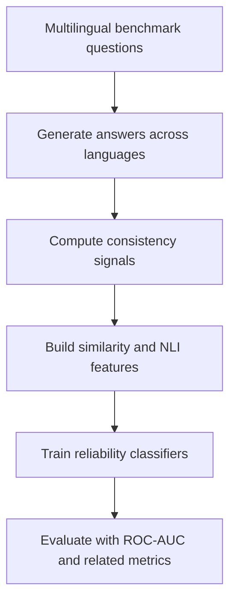

# Cross-Lingual Consistency for LLM Reliability

Can agreement across languages help identify when a large language model is likely to be correct?

This project investigates **cross-lingual answer consistency as a reliability signal for LLM outputs**. We compare agreement across languages with monolingual self-consistency and enrich the analysis with multilingual semantic-similarity and natural language inference (NLI) features. Lightweight classifiers then use these signals to distinguish more reliable answers from less reliable ones.

## Why this matters

Large language models can produce confident but incorrect answers. Standard confidence signals are often unavailable to end users and may not reflect whether an answer is factually correct. Cross-lingual prompting offers another perspective: if a model reaches semantically consistent answers when the same question is expressed in different languages, that agreement may provide evidence of reliability.

Cross-lingual agreement is **not a guarantee of correctness**—a model can repeat the same mistake in multiple languages—but it can serve as a useful warning or ranking signal.

## Research questions

1. Is cross-lingual consistency associated with answer correctness?
2. Does it provide a stronger reliability signal than monolingual self-consistency?
3. Do semantic-similarity and NLI features improve reliability prediction?
4. How well do these signals generalize across multilingual reasoning and question-answering tasks?

## Method

For each question, the pipeline compares answers produced in multiple languages. The resulting features capture whether the answers agree lexically, semantically, or logically. Logistic regression and a multilayer perceptron (MLP) are used to test whether these features can predict answer reliability.

## Datasets

| Dataset | Task | Role in the study |
| --- | --- | --- |
| **MGSM** | Multilingual grade-school math reasoning | Tests consistency on reasoning problems with verifiable numeric answers |
| **XQuAD** | Cross-lingual extractive question answering | Tests multilingual consistency across parallel QA examples |
| **MKQA** | Multilingual knowledge question answering | Tests reliability signals on knowledge-intensive questions |

## Reliability features

| Feature group | What it captures |
| --- | --- |
| **Cross-lingual consistency** | Agreement among answers generated for equivalent questions in different languages |
| **Monolingual self-consistency** | Agreement among repeated answers generated in the same language |
| **LaBSE similarity** | Language-agnostic semantic similarity between answer representations |
| **XLM-R NLI** | Entailment and contradiction relationships among multilingual answers |

## Models and evaluation

We evaluate both individual signals and combinations of features using:

- Logistic regression as an interpretable baseline
- A multilayer perceptron for nonlinear feature interactions
- ROC-AUC as the primary ranking metric, supplemented by standard classification metrics where appropriate

## Key result

On **MGSM**, cross-lingual consistency alone achieved a **ROC-AUC of approximately 0.839** in our experimental setup and outperformed the corresponding monolingual self-consistency signal. This result suggests that multilingual agreement can provide useful information about answer reliability, even without access to a model's internal probabilities.

Results should be interpreted within the evaluated datasets, languages, prompting procedure, and model configuration. They do not establish cross-lingual agreement as a universal correctness detector.

## Reproducing the analysis

The experimental workflow is:

1. Prepare aligned multilingual examples from MGSM, XQuAD, and MKQA.
2. Generate model answers for each language and repeated same-language trials.
3. Normalize answers and compute cross-lingual and monolingual consistency scores.
4. Encode answer pairs with LaBSE and obtain entailment/contradiction scores with an XLM-R-based NLI model.
5. Assemble question-level features and correctness labels.
6. Train logistic-regression and MLP classifiers.
7. Evaluate on held-out data and compare feature groups using ROC-AUC.

Exact commands, environment details, random seeds, and model identifiers should be documented alongside the corresponding scripts or notebooks in the repository so that reported results can be reproduced precisely.

## Limitations

- A model may produce the same incorrect answer across multiple languages.
- Translation quality and language-specific prompting can affect consistency scores.
- Semantic similarity does not necessarily imply factual equivalence.
- Benchmark answer matching may not capture every valid response.
- Performance may vary across languages, domains, and model families.
- The current results are experimental and should not be treated as calibrated confidence estimates for production use.

## Project context

This project was completed as a collaborative course project for **Natural Language Processing for Computational Social Science** at Johns Hopkins University.

## License

The original code and documentation in this repository are available under the [MIT License](LICENSE). Datasets, pretrained models, and other third-party resources are governed by their respective licenses and terms of use and are not relicensed by this repository.

If this repository contains work created by multiple team members, confirm that all contributors agree to the selected license before publishing the code under it.
